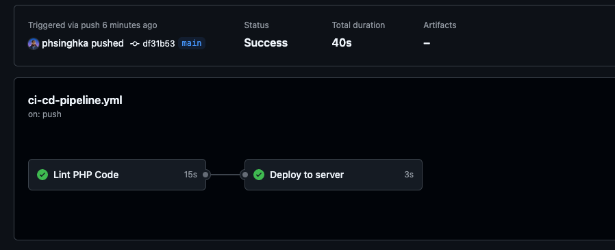
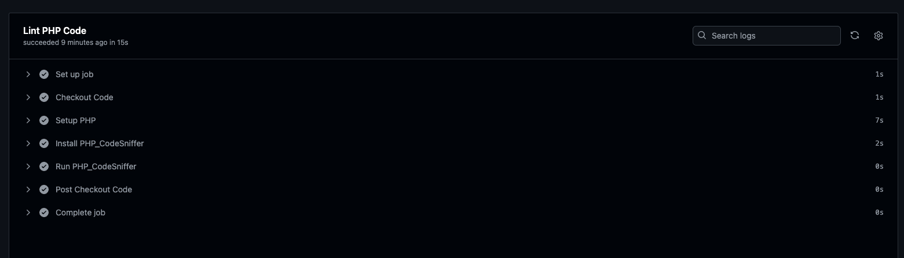

# CI/CD Pipeline for LAMP Stack Application

This repository contains the code and configuration for a CI/CD pipeline designed for a LAMP (Linux, Apache, MySQL, PHP) stack application. The pipeline is fully automated using GitHub Actions and includes stages for linting, testing, building, and deploying the application.

## Features

- **Automated Linting:** PHP_CodeSniffer is used to enforce coding standards.
- **Automated Build:** The application is built and packaged for deployment.
- **Automated Deployment:** The built application is deployed to a remote Apache server via SSH.
- **Notifications:** Pipeline status notifications are sent to the team.

## Folder Structure

```plaintext
ci-cd-github-actions-lamp/
│
├── .github/
│   └── workflows/
│       └── ci-cd-pipeline.yml      # GitHub Actions workflow file
│
├── src/
│   ├── index.php                   # Main PHP application file
│   ├── config.php                  # Database configuration
│   └── lib/
│       └── some-logic.php          # Example PHP logic file
│
├── deploy/
│   └── deploy.sh                   # Deployment script
│
├── docs/
│   ├── screenshots/                # Screenshots for showcasing
│   │   ├── screenshot-1.png        # Screenshot 1: GitHub Actions workflow
│   └── └── screenshot-2.png        # Screenshot 2: Lint tests passing
│
└── README.md                       
```

## How to Use

1. **Clone the Repository**
   ```bash
   git clone https://github.com/phsinghka/ci-cd-github-actions-lamp.git
   cd ci-cd-github-actions-lamp
   ```

2. **Set Up the Remote Server**
   - Ensure you have a remote Linux server with Apache, MySQL, and PHP installed.
   - Set up SSH access for deployment.

3. **Configure the CI/CD Pipeline**
   - Modify `.github/workflows/ci-cd-pipeline.yml` to match your environment settings.

4. **Run the Pipeline**
   - Push code changes to the `main` branch to trigger the CI/CD pipeline.

5. **Monitor the Pipeline**
   - Monitor the pipeline's progress and ensure the application is deployed successfully.

## Screenshots

- **GitHub Actions Workflow Execution**: <br/>
  

- **Lint Tests Passing**:
  